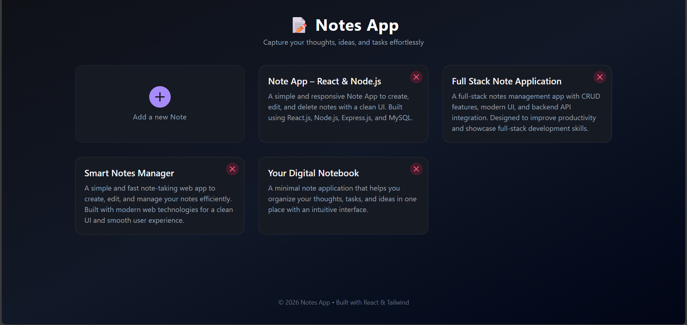

# 🔍 GitHub Profile Detective App

A responsive web application that allows users to search and explore GitHub profiles in real time using the GitHub API. This project helps users quickly view profile details, repositories, and activity with a clean and modern UI.

---

## 🚀 Live Demo

🔗 https://notes-app-easy.netlify.app/

---

## ✨ Features

- 🔎 Search GitHub users by username  
- 👤 View profile information (avatar, name, bio, location)  
- 👥 Display followers and following count  
- 📦 List public repositories  
- ⚡ Real-time data fetching using GitHub API  
- 📱 Fully responsive design for all devices  

---

## 🛠️ Tech Stack

- **Frontend:** HTML, CSS, JavaScript / React.js  
- **API:** GitHub REST API  
- **Styling:** CSS / Tailwind CSS  
- **Deployment:** Netlify / Vercel  

---

## 📸 Screenshot

---

## ⚙️ How It Works

1. Enter a GitHub username in the search input  
2. The app sends a request to the GitHub API  
3. User profile data and repositories are displayed instantly  

---

## 🚀 Roadmap

### ✅ Current Features
- Fully responsive design across all devices  
- Smooth animations for better user experience  
- Secure contact form handling  

### 🔮 Upcoming Improvements
- Dark mode toggle 🌙 for a comfortable viewing experience  
- Blog section 📝 to share tutorials and insights  
- Multilingual support 🌎 to reach a wider audience  

---

## 📬 Contact

Feel free to reach out to me:

- [LinkedIn](https://www.linkedin.com/in/jay-avgune-1316b323a?utm_source=share&utm_campaign=share_via&utm_content=profile&utm_medium=android_app) 
- [Instagram](https://www.instagram.com/jay.avgune?igsh=ejF2YW44bXNrZ3Ry)
---
